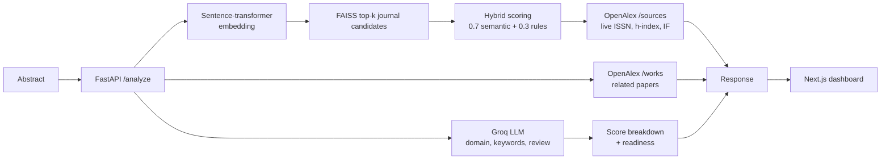

# AI Journal Copilot

<p align="center">
  <b>Paste an abstract, get journal recommendations, an estimated acceptance probability, related work, and editorial-style feedback.</b>
</p>

<p align="center">
  
  
  
  
  
</p>

---

## Live demo

https://ai-journal-copilot.vercel.app

---

## What it does

Choosing where to submit a paper is slow and subjective. AI Journal Copilot turns an abstract into:

- **A detected research domain & subfield** (Groq Llama-3.1)
- **3 journal recommendations** ranked by hybrid score (semantic embeddings + rule-based domain/keyword/methodology overlap), enriched with **live OpenAlex metadata**: ISSN, h-index, 2-year mean citedness, OA status, real homepage URL
- **An estimated acceptance probability** computed from clarity, novelty, technical depth, and journal fit
- **Up to 5 related papers** from OpenAlex (title, authors, year, venue, citation count, OA PDF link)
- **Editorial-style review**: decision, confidence, summary, strengths, weaknesses
- **Submission readiness score** broken down by 4 dimensions, with a tier verdict
- **Categorized improvement suggestions** (Comparison / Validation / Experiments / Discussion / …) with local check-off tracking
- **A rewrite of the abstract** for clearer methodology and better journal fit

Plus a **Batch Analyze** tab to run multiple abstracts at once and a CLI **dev test script** to validate output across domains.

---

## Architecture



---

## Tech stack

**Frontend** — Next.js 16 (App Router), Tailwind CSS, shadcn/ui, Lucide icons, TypeScript.

**Backend** — FastAPI, Groq Llama-3.1 8B (`llama-3.1-8b-instant`), `sentence-transformers` for dense embeddings, FAISS for top-k retrieval.

**External data** — [OpenAlex](https://openalex.org) (free, no API key) for live journal metadata and related papers. [Semantic Scholar](https://www.semanticscholar.org/product/api) optional fallback when `SEMANTIC_SCHOLAR_API_KEY` is set.

**Hybrid scoring** — semantic similarity (70%) + rule-based domain/keyword/methodology overlap (30%), normalized to 55–95.

---

## Setup

### 1. Clone

```bash
git clone https://github.com/Ks-Gupta/ai-journal-copilot.git
cd ai-journal-copilot
```

### 2. Backend

```bash
cd backend
python -m venv venv
source venv/bin/activate          # Windows: venv\Scripts\activate
pip install -r requirements.txt
```

Create `backend/.env`:

```env
GROQ_API_KEY=your_groq_api_key
# Optional — Semantic Scholar is used as fallback when set:
# SEMANTIC_SCHOLAR_API_KEY=your_key
```

Run:

```bash
uvicorn app.main:app --reload
# → http://127.0.0.1:8000
# → Swagger UI at /docs
```

### 3. Frontend

```bash
cd frontend
npm install
npm run dev
# → http://localhost:3000
```

If your backend isn't on `http://localhost:8000`, set in `frontend/.env.local`:

```env
NEXT_PUBLIC_API_URL=https://your-backend-url
```

---

## API

| Method | Path | Purpose |
|---|---|---|
| `GET` | `/health` | Liveness check |
| `POST` | `/analyze` | Full analysis pipeline (LLM → scoring → journal match → related papers) |
| `POST` | `/improve` | Rewrite the abstract for clarity and journal fit |
| `GET` | `/history` | Recent analyses |

Interactive docs at `http://127.0.0.1:8000/docs`.

---

## Dev tools

### Test the pipeline across domains

```bash
cd backend && source venv/bin/activate
python scripts/test_abstracts.py                     # all 10 preset abstracts
python scripts/test_abstracts.py --only nlp,security # filter
python scripts/test_abstracts.py --delay 1           # be kind to OpenAlex
```

Prints detected domain, top 3 journals (with Q/IF/publisher), and top 3 related papers per abstract — useful for sanity-checking after changing the journal DB or scoring.

### Batch analyze in the UI

The **Batch Analyze** tab in the sidebar lets you paste multiple abstracts and run them sequentially with live status indicators.

---

## Project structure

```
backend/
├─ app/
│  ├─ main.py              # FastAPI app + CORS + FAISS index build
│  ├─ api/routes.py        # /analyze, /improve, /history, /health
│  ├─ services/
│  │   ├─ llm_service.py          # Groq client (analyze + free-text)
│  │   ├─ embedding_service.py    # sentence-transformers
│  │   ├─ vector_db.py            # FAISS index
│  │   ├─ journal_service.py      # hybrid scoring + per-journal reasons
│  │   ├─ scoring_service.py      # acceptance breakdown
│  │   ├─ paper_service.py        # OpenAlex /sources + /works (cached)
│  │   ├─ improvement_service.py  # abstract rewrite
│  │   └─ history_service.py      # in-memory history
│  ├─ data/journals.py     # 22 journals across 11 domain clusters
│  ├─ models/schemas.py    # Pydantic
│  └─ utils/parser.py      # safe JSON parsing
├─ scripts/test_abstracts.py
└─ requirements.txt

frontend/
├─ app/                    # Next.js App Router
├─ components/
│  ├─ dashboard.tsx              # top-level shell + auto-analyze + AbortController
│  ├─ input-panel.tsx
│  ├─ results-panel.tsx          # orchestrates the full results view
│  ├─ journal-card.tsx           # ranked card with live OpenAlex metadata
│  ├─ related-paper-card.tsx     # OpenAlex paper rows
│  ├─ improvements-card.tsx      # categorized suggestions w/ check-off
│  ├─ submission-readiness.tsx   # composite score + rewrite
│  ├─ batch-page.tsx             # batch tab
│  └─ ai-thinking.tsx            # checklist loader
└─ lib/
   ├─ api.ts               # API_URL from NEXT_PUBLIC_API_URL with localhost fallback
   └─ utils.ts             # cn()
```

---

## Notable design choices

- **Hybrid scoring**, not pure embeddings — rule-based bonuses for direct domain/keyword matches keep the top-1 honest when semantic similarity is fooled by shared vocabulary (e.g., "deep learning" appearing in many descriptions).
- **Live journal metadata** comes from OpenAlex `/sources` per request (with in-memory caching so repeat lookups are instant). Hardcoded values in `journals.py` act as fallback if the API is unreachable.
- **Improvement suggestions are deliberately distinct from reviewer weaknesses** — not derived from them — so the two sections don't read as the same content rephrased.
- **Frontend cancellation**: every new `/analyze` call aborts the prior in-flight request via `AbortController`, so debounced auto-analyze never produces a stale render.
- **No emojis, minimal gradients, sentence case** — the UI tries to look like a research tool rather than a "powered by AI" demo.

---

## Roadmap

- [ ] PDF upload with auto abstract extraction
- [ ] Persistent history (SQLite / Supabase)
- [ ] Styled PDF export with charts and reviewer cards
- [ ] User accounts and saved analyses
- [ ] More journals across humanities & social sciences

---

## Contributing

PRs welcome. Fork → branch → commit → PR.

---

## Author

**Khushi Gupta** — Tech Graduate Trainee @ Taylor & Francis. Backend & AI systems.

---
